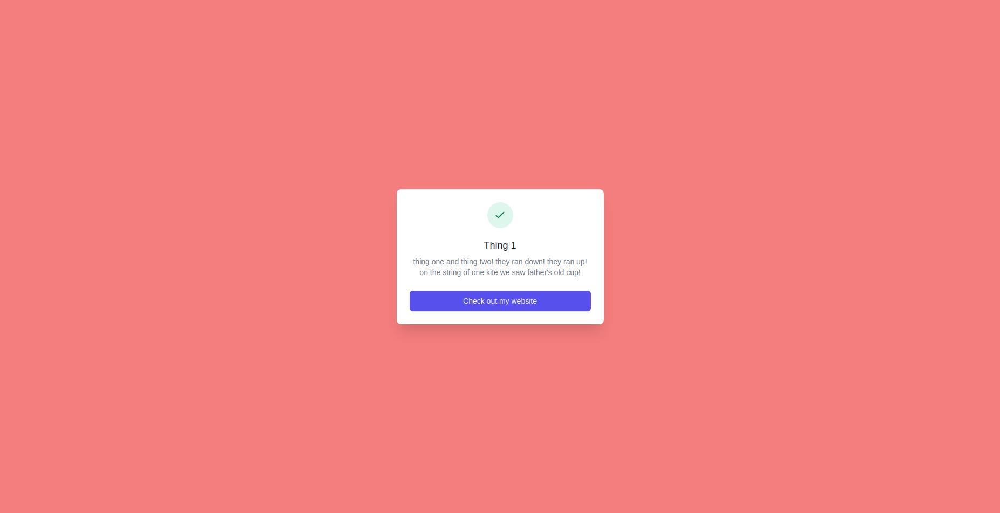
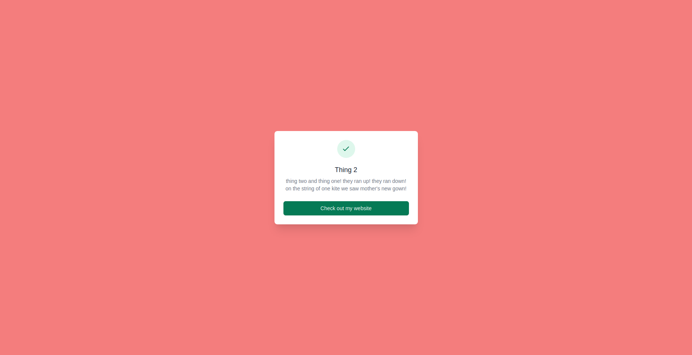

# Cloudflare Workers Internship Application: Full-Stack

This is my submission for cloudflare's full stack internship position.

Workers link: https://worker.jonathanxu.workers.dev/

Using Cloudflare Workers, this is an application that will randomly send users to one of two webpages.

## Features
**HTML Rewriter**: The web page title, headers, description, and background styling is dynamically changed using the HTMLRewriter API in the Workers runtime. The theme is based off Dr. Seus' Cat in the Hat book!

**Persisting variants**: The website uses cookies to remember which variant to show the user.

## Screenshots
Variant 1:

Variant 2:
